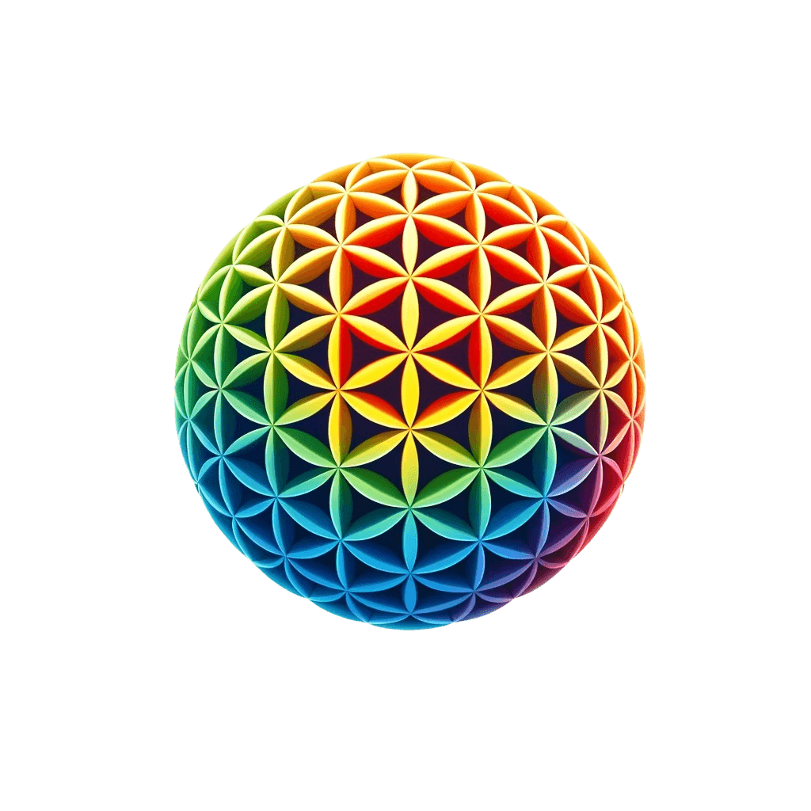

# 🤖 OMNII

> **Reclaim your humanity. Let AI handle the rest.**

<div align="center">



**Transform chaos into clarity, insights into action, potential into progress.**

[](https://omnii.net)
[](https://reactnative.dev/)
[](https://www.typescriptlang.org/)
[](https://expo.dev/)

[🌐 Website](https://omnii.net) • [📱 Download](https://omnii.net) • [📧 Contact](mailto:contact@omnii.net)

</div>

---

## ✨ What is OMNII?

OMNII is your **AI-powered productivity partner** that evolves with you. Born from the vision that technology should amplify human potential, not replace it, OMNII transforms the overwhelming complexity of modern productivity into an intuitive, gamified experience.

### 🎯 Core Philosophy

```
🧠 Human creativity + 🤖 AI efficiency = 🚀 Limitless potential
```

We believe that the future belongs to those who can seamlessly blend human intuition with artificial intelligence. OMNII doesn't just manage your tasks—it learns your patterns, anticipates your needs, and grows alongside your ambitions.

---

## 🌟 Features

### 🚀 **AI-Driven Task Management**
- **Auto**: AI-curated task suggestions based on priority and context
- **Collab**: Collaborative workflows with intelligent team coordination  
- **Daily**: Smart daily routines that adapt to your energy patterns
- **Goal**: Strategic goal alignment with automated progress tracking

### 🎮 **Gamified Progress System**
- **XP & Levels**: Earn experience points for productivity achievements
- **Mascot Companion**: Your AI companion that cheers your progress
- **Achievement System**: Unlock milestones as you build better habits
- **Level Celebrations**: Beautiful animations for reaching new levels

### 🔗 **Universal Integration**
```
📧 Gmail      📅 Google Calendar      ✅ Google Tasks      💾 Google Drive
📞 Contacts  🎵 Spotify             💳 Stripe Billing    🔐 Secure Auth
```

### 🎨 **Beautiful Design**
- **NativeWind V4**: Tailwind CSS styling for consistent design
- **Responsive Layout**: Seamless experience across mobile, tablet, and desktop
- **Dark/Light Themes**: Adaptive theming that matches your preference
- **Smooth Animations**: Delightful micro-interactions using Reanimated

---

## 🏗️ Architecture

OMNII is built as a modern **TypeScript monorepo** with a focus on scalability, type safety, and developer experience.

```
omnii/
├── 📱 apps/
│   ├── omnii-mobile/          # React Native app (iOS, Android, Web)
│   ├── omnii_mcp/             # AI backend services  
│   └── python-rdf/            # RDF semantic analysis service
├── 📦 packages/
│   ├── api/                   # tRPC API definitions
│   ├── auth/                  # Better-auth configuration
│   ├── db/                    # Drizzle ORM + Supabase
│   ├── ui/                    # Shared UI components
│   └── validators/            # Zod schemas & type guards
└── 🛠️ tooling/
    ├── eslint/                # ESLint configurations
    ├── prettier/              # Code formatting
    ├── tailwind/              # Shared Tailwind config
    └── typescript/            # TypeScript configurations
```

### 🔧 **Tech Stack**

| Layer | Technology | Purpose |
|-------|------------|---------|
| **Frontend** | React Native + Expo | Cross-platform mobile & web |
| **Styling** | NativeWind V4 + Tailwind | Consistent design system |
| **State** | Zustand + React Query | Global state & server state |
| **API** | tRPC v11 | End-to-end type safety |
| **Database** | Supabase + Drizzle ORM | PostgreSQL with type safety |
| **Auth** | Better-auth | Secure authentication |
| **AI** | Custom LLM integrations | Intelligent task processing |
| **Validation** | Zod | Runtime type validation |
| **Build** | Turborepo + pnpm | Monorepo management |

---

## 🚀 Quick Start

### Prerequisites

```bash
# Required versions (see package.json#engines)
node >= 18.0.0
pnpm >= 8.0.0
```

### 1. **Clone & Install**

```bash
# Clone the repository
git clone https://github.com/omnii/omnii.git
cd omnii

# Install dependencies
pnpm install

# Copy environment configuration
cp .env.example .env
```

### 2. **Environment Setup**

Configure your `.env` file with:

```bash
# Supabase
EXPO_PUBLIC_SUPABASE_URL=your_supabase_url
EXPO_PUBLIC_SUPABASE_ANON_KEY=your_supabase_key

# Google OAuth
EXPO_PUBLIC_GOOGLE_CLIENT_ID=your_google_client_id
EXPO_PUBLIC_GOOGLE_WEB_CLIENT_ID=your_web_client_id
EXPO_PUBLIC_GOOGLE_IOS_CLIENT_ID=your_ios_client_id

# Backend Services
EXPO_PUBLIC_BACKEND_BASE_URL=your_backend_url
```

### 3. **Database Setup**

```bash
# Push database schema
pnpm db:push

# Generate types
pnpm db:generate
```

### 4. **Start Development**

```bash
# Start all services
pnpm dev

# Or start specific apps
pnpm dev:mobile    # Mobile app
pnpm dev:web       # Web version
pnpm dev:api       # Backend services
```

---

## 📱 Platform Support

### **Mobile** (React Native)
- ✅ iOS (iPhone & iPad)
- ✅ Android (Phone & Tablet)
- ✅ Expo Go for development
- ✅ Standalone builds for production

### **Web** (Next.js)
- ✅ Desktop browsers (Chrome, Safari, Firefox, Edge)
- ✅ Mobile browsers with responsive design
- ✅ PWA capabilities
- ✅ Static site generation for SEO

### **Desktop** (Future)
- 🔄 Electron app (planned)
- 🔄 Tauri app (planned)

---

## 🔮 AI Features

OMNII's intelligence comes from multiple AI systems working in harmony:

### **🧠 Task Intelligence**
- **Smart Categorization**: Automatically sorts tasks by type and priority
- **Context Awareness**: Understands your work patterns and energy levels
- **Predictive Scheduling**: Suggests optimal times for different task types
- **Goal Alignment**: Ensures daily tasks align with long-term objectives

### **📊 Productivity Analytics**
- **Pattern Recognition**: Identifies your most productive times and contexts
- **Habit Formation**: Tracks and reinforces positive productivity habits
- **Energy Mapping**: Correlates task completion with your energy patterns
- **Achievement Prediction**: Forecasts goal completion likelihood

### **🤝 Collaborative AI**
- **Team Coordination**: Intelligently manages collaborative workflows
- **Communication Optimization**: Suggests optimal communication timing
- **Workload Balancing**: Distributes tasks based on team capacity
- **Meeting Intelligence**: Analyzes calendar patterns for better scheduling

---

## 🎮 Gamification System

### **📈 Experience Points (XP)**
Earn XP for productivity actions:
- ✅ Completing tasks: `15-50 XP`
- 🎯 Achieving goals: `100-500 XP`
- 🔥 Maintaining streaks: `25 XP/day`
- 📚 Learning new habits: `75 XP`

### **🏆 Achievement System**
Unlock achievements for:
- **Productivity Milestones**: Complete 100 tasks, maintain 30-day streaks
- **Integration Mastery**: Connect all services, optimize workflows
- **Goal Achievement**: Reach personal and professional goals
- **Community Impact**: Help team members, share insights

### **🎭 Mascot Companion**
Your AI mascot evolves with your level:
- **Levels 1-10**: Curious learner
- **Levels 11-25**: Productive partner  
- **Levels 26-50**: Wisdom guide
- **Levels 51+**: Master mentor

---

## 🚀 Deployment

### **Mobile Apps**

```bash
# iOS (requires Apple Developer account)
eas build --platform ios --profile production
eas submit --platform ios --latest

# Android (requires Google Play Console)
eas build --platform android --profile production
eas submit --platform android --latest
```

### **Web Application**

```bash
# Build for production
pnpm build:web

# Deploy to Vercel (recommended)
vercel --prod

# Or deploy to any static hosting
cp -r dist/* /your/hosting/directory/
```

### **Backend Services**

```bash
# Deploy AI services
pnpm deploy:api

# Deploy RDF service
pnpm deploy:rdf
```

---

## 🧪 Testing

```bash
# Run all tests
pnpm test

# Platform-specific tests
pnpm test:mobile      # React Native tests
pnpm test:web         # Web-specific tests
pnpm test:api         # Backend API tests

# Test with coverage
pnpm test:coverage

# E2E tests
pnpm test:e2e
```

---

## 🤝 Contributing

We believe in the power of community to shape the future of productivity. While OMNII's core is proprietary, we welcome contributions that make the experience better for everyone.

### **How to Contribute**

1. **🐛 Report Issues**: Found a bug? [Open an issue](mailto:contact@omnii.net)
2. **💡 Suggest Features**: Have an idea? We'd love to hear it
3. **📖 Improve Documentation**: Help others understand OMNII better
4. **🎨 Design Feedback**: Share your UX/UI insights

### **Development Workflow**

```bash
# 1. Create feature branch
git checkout -b feature/amazing-feature

# 2. Make your changes
# ... code, test, refine ...

# 3. Test thoroughly
pnpm test
pnpm lint
pnpm type-check

# 4. Submit for review
git push origin feature/amazing-feature
```

---

## 📄 License

**Proprietary Software License**

Copyright © 2025 [Omnii Net LLC](https://omnii.net). All rights reserved.

This software is proprietary and confidential. See [LICENSE](./LICENSE) for full terms.

For licensing inquiries: [contact@omnii.net](mailto:contact@omnii.net)

---

## 🌟 Vision

> *"In a world drowning in digital noise, OMNII cuts through the chaos to help you focus on what truly matters. We're not just building an app—we're crafting a movement that puts humanity back at the center of productivity."*

### **Our Mission**
To create technology that amplifies human potential while preserving the essence of what makes us human—creativity, intuition, and meaningful connection.

### **Our Values**
- 🧠 **Human-Centric Design**: Technology serves people, not the other way around
- 🤖 **Intelligent Automation**: AI handles routine tasks so you can focus on impact
- 🎯 **Purposeful Productivity**: Every feature drives meaningful progress
- 🌱 **Continuous Evolution**: We grow and adapt alongside our users
- 🤝 **Collaborative Spirit**: Together we achieve more than alone

---

## 📞 Support

**Need help? We're here for you.**

- 🌐 **Website**: [omnii.net](https://omnii.net)
- 📧 **Email**: [contact@omnii.net](mailto:contact@omnii.net)
- 📱 **App Support**: Available in-app via the support section
- 📍 **Address**: PO BOX 10694, Zephyr Cove, Nevada 89448, USA

---

<div align="center">

**Made with ❤️ by the OMNII Team**

*Reclaim your humanity. Let AI handle the rest.*

[](https://omnii.net)

</div>
