# SMS AI Calendar Management - Technical Architecture

## System Architecture Overview

```mermaid
graph TB
    subgraph "User Interface"
        SMS[📱 SMS Messages]
        Phone[📞 Phone Numbers]
    end

    subgraph "Twilio Gateway"
        TwilioWebhook[🔗 Webhook Endpoint]
        TwilioAPI[📤 SMS API]
    end

    subgraph "SMS AI System"
        SMSRoutes[🛣️ SMS Routes]
        SimpleSMSAI[🧠 SimpleSMSAI Orchestrator]

        subgraph "Core Managers"
            TimezoneManager[🌍 TimezoneManager]
            CalendarManager[📅 CalendarManager]
        end

        subgraph "AI Services"
            OpenAI[🤖 OpenAI GPT-4o-mini]
            ComposioAI[🔧 Composio AI Tools]
        end
    end

    subgraph "External Services"
        GoogleCalendar[📆 Google Calendar API]
        ComposioOAuth[🔐 Composio OAuth]
        GoogleMeet[🎥 Google Meet]
    end

    subgraph "Data Layer"
        PhoneMapping[📋 Phone → Email Mapping]
        TimezoneStorage[🕐 Timezone Storage]
        ConnectionCache[💾 Connection Cache]
    end

    SMS --> TwilioWebhook
    TwilioWebhook --> SMSRoutes
    SMSRoutes --> SimpleSMSAI

    SimpleSMSAI --> TimezoneManager
    SimpleSMSAI --> CalendarManager

    TimezoneManager --> OpenAI
    CalendarManager --> ComposioAI
    CalendarManager --> OpenAI

    ComposioAI --> GoogleCalendar
    ComposioAI --> ComposioOAuth
    GoogleCalendar --> GoogleMeet

    SimpleSMSAI --> PhoneMapping
    TimezoneManager --> TimezoneStorage
    CalendarManager --> ConnectionCache

    CalendarManager --> TwilioAPI
    SMSRoutes --> TwilioAPI
    TwilioAPI --> SMS
```



## Component Interaction Flow

### Message Processing Pipeline

```mermaid
sequenceDiagram
    participant User as 📱 User
    participant Twilio as 🔗 Twilio
    participant Routes as 🛣️ SMS Routes
    participant AI as 🧠 SimpleSMSAI
    participant TZ as 🌍 TimezoneManager
    participant Cal as 📅 CalendarManager
    participant OpenAI as 🤖 OpenAI
    participant Composio as 🔧 Composio
    participant GCal as 📆 Google Calendar

    User->>Twilio: SMS Message
    Twilio->>Routes: Webhook POST
    Routes->>AI: processMessage()

    AI->>AI: validatePhoneNumber()
    AI->>TZ: needsTimezoneSetup()

    alt Timezone Setup Required
        TZ->>OpenAI: inferTimezone(city)
        OpenAI->>TZ: IANA timezone
        TZ->>User: Confirmation SMS
    else Calendar Operation
        AI->>Cal: isCalendarMessage()
        Cal->>Cal: checkConnection()

        alt No Connection
            Cal->>Composio: initiateOAuth()
            Composio->>User: OAuth Link SMS
        else Active Connection
            Cal->>OpenAI: processEvent()
            OpenAI->>Composio: GOOGLECALENDAR_CREATE_EVENT
            Composio->>GCal: Create Event
            GCal->>Composio: Event + Meet Link
            Composio->>Cal: Success Response
            Cal->>User: Confirmation SMS
        end
    end

    Routes->>Twilio: TwiML Response
    Twilio->>User: SMS Delivery
```



## Data Flow Architecture

### Phone Number to Entity Mapping


### Event Processing Flow


## Service Layer Architecture

### SimpleSMSAI Orchestrator

```typescript
class SimpleSMSAI {
  // Core dependencies
  private openai: OpenAI;
  private timezoneManager: TimezoneManager;
  private calendarManager: CalendarManager;

  // Entity mapping
  private phoneToEmailMap: Record<string, string>;

  // Main processing pipeline
  async processMessage(
    message: string,
    phoneNumber: string,
    localDatetime?: string
  ) {
    // 1. Validate phone number
    // 2. Check timezone setup
    // 3. Classify message type
    // 4. Route to appropriate manager
    // 5. Handle response delivery
  }
}
```

### TimezoneManager

```typescript
class TimezoneManager {
  // Setup state tracking
  private setupStates: Map<string, TimezoneSetupState>;
  private userTimezones: Map<string, string>;

  // AI-powered timezone inference
  async inferTimezoneFromCity(cityName: string): Promise<string>;

  // Setup flow management
  needsTimezoneSetup(phoneNumber: string): boolean;
  isInTimezoneSetup(phoneNumber: string): boolean;
  handleTimezoneSetup(phoneNumber: string, message: string);
}
```

### CalendarManager

```typescript
class CalendarManager {
  private openai: OpenAI;
  private composio: OpenAIToolSet;

  // Connection management
  async getUserConnections(entityId: string): Promise<any[]>;
  findActiveConnection(connections: any[]): any | null;
  setupOAuthConnection(entityId: string, phoneNumber: string);

  // Calendar operations
  async listEvents(entityId: string, userTimezone: string, phoneNumber: string);
  async processCalendarEvent(
    message: string,
    phoneNumber: string,
    entityId: string
  );

  // Message classification
  isCalendarMessage(message: string): boolean;
  isListEventsMessage(message: string): boolean;
}
```

## Integration Architecture

### Composio Integration Layer


### OAuth Flow Architecture


## Error Handling Architecture

### Error Classification


### Logging Strategy

```typescript
// Decision point logging
console.log(
  `🚨 [CalendarManager] NO EVENTS DECISION: events.length = ${events.length}`
);
console.log(`🚨 [CalendarManager] Search range: ${pastWeek} to ${nextWeek}`);
console.log(`🚨 [CalendarManager] Entity ID: ${entityId}`);

// Success logging
console.log(
  `✅ [CalendarManager] EVENTS FOUND: Processing ${events.length} events`
);
console.log(
  `✅ [CalendarManager] Past: ${pastEvents.length}, Future: ${futureEvents.length}`
);

// Error logging with context
console.error(`❌ [CalendarManager] Error:`, error);
console.error(`❌ [CalendarManager] Context:`, {
  entityId,
  phoneNumber,
  userTimezone,
});
```

## Performance & Scalability

### Caching Strategy


### Rate Limiting

```typescript
// Per-user rate limiting
const rateLimits = {
  messagesPerMinute: 10,
  eventsPerHour: 50,
  oauthAttemptsPerDay: 5,
};

// Global rate limiting
const globalLimits = {
  totalMessagesPerMinute: 1000,
  composioCallsPerMinute: 500,
};
```

## Security Architecture

### Data Protection


### Access Control

```typescript
// Phone number whitelist
private phoneToEmailMap: Record<string, string> = {
  "+16286885388": "edenchan717@gmail.com",
  "+18582260766": "santino62@gmail.com",
};

// OAuth scope limitation
const requiredScopes = [
  "https://www.googleapis.com/auth/calendar.events",
  "https://www.googleapis.com/auth/calendar.readonly"
];
```

## Monitoring & Observability

### Metrics Collection

```typescript
// Key metrics to track
const metrics = {
  messageVolume: "messages_per_minute",
  responseTime: "avg_response_time_ms",
  successRate: "successful_operations_percent",
  errorRate: "error_rate_percent",
  oauthCompletions: "oauth_completions_per_day",
  eventCreations: "events_created_per_day",
  eventLists: "event_lists_per_day",
};
```

### Health Checks

```typescript
// Service health endpoint
GET /api/sms/health
{
  "success": true,
  "service": "sms-ai",
  "status": "healthy",
  "config": {
    "hasOpenAI": true,
    "hasComposio": true,
    "hasTwilio": true
  },
  "timestamp": "2025-05-27T03:56:43.261Z"
}
```

---

_This technical architecture documentation provides a comprehensive view of the SMS AI Calendar Management system's internal structure, data flows, and integration patterns._
