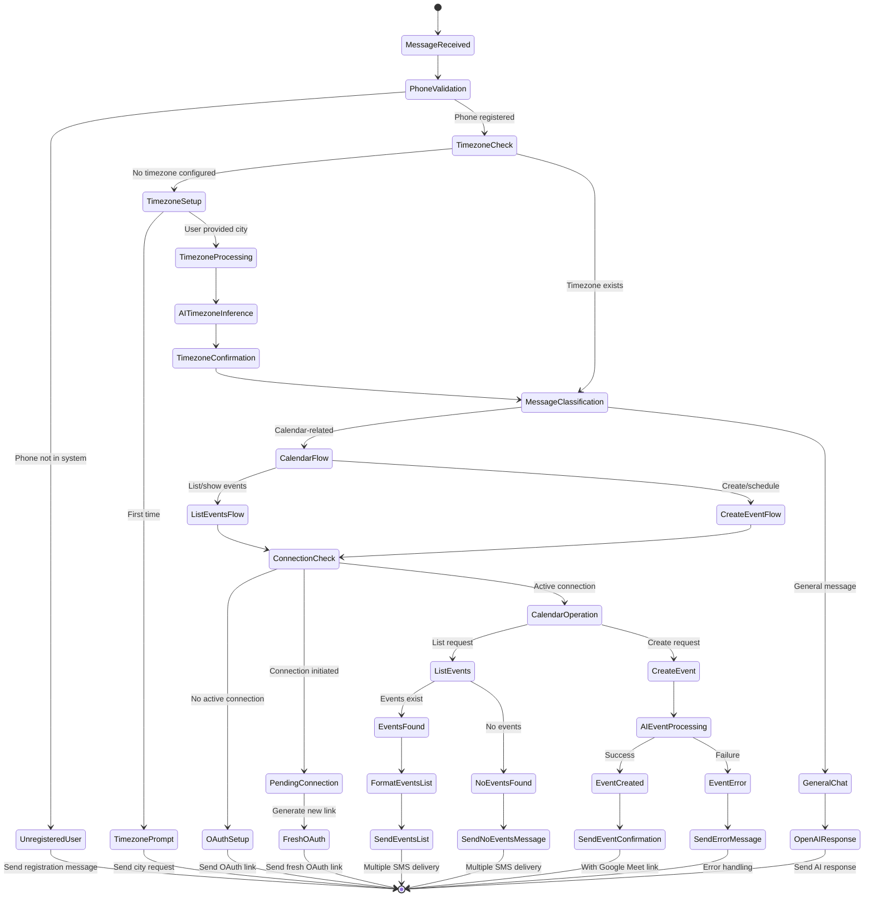

# SMS AI Calendar Management Flow

## Overview

The SMS AI Calendar Management system provides a delightful, conversational interface for managing Google Calendar events via text messages. Users can create events, list upcoming meetings, and manage their calendar through natural language SMS interactions.

## Design Philosophy: Delightful Calendar Management

### Core Principles

- **Natural Language**: Users text in plain English, no commands to memorize
- **Contextual Intelligence**: AI understands dates, times, and context automatically
- **Proactive Assistance**: System guides users through setup and provides helpful suggestions
- **Reliable Delivery**: Multiple SMS delivery mechanisms ensure messages reach users
- **Timezone Awareness**: Smart timezone detection and management
- **Visual Clarity**: Clean, emoji-enhanced responses for easy scanning

## State Machine Flow



## User Experience Flow

### 1. First-Time User Journey

```
User: "Hello"
System: "Hi! What city are you in? (e.g., New York, LA, Chicago)"

User: "San Francisco"
System: "✅ Timezone set to Pacific Time (America/Los_Angeles). You're all set!"

User: "Create a meeting tomorrow at 2pm"
System: "To create calendar events, please connect your Google account: [OAuth Link]"
```

### 2. Returning User - Event Creation

```
User: "Schedule a team standup tomorrow at 9am"
System: "✅ 'Team standup' scheduled successfully!
📅 Tue, May 28 at 9:00 AM
🔗 Join: https://meet.google.com/abc-defg-hij"
```

### 3. Event Listing Experience

```
User: "What meetings do I have?"
System: "📅 Your calendar events:

🕐 PAST WEEK:
1. Client Review
   Mon, May 20 at 3:00 PM

🔮 UPCOMING:
1. Team Standup
   Tue, May 28 at 9:00 AM
2. Project Planning
   Wed, May 29 at 2:00 PM

... and 3 more events"
```

## Technical Implementation

### Architecture Components

#### 1. SimpleSMSAI (Orchestrator)

- **Role**: Main coordinator and message router
- **Responsibilities**:
  - Phone number validation and entity mapping
  - Message classification and routing
  - Error handling and fallback responses

#### 2. TimezoneManager

- **Role**: Timezone setup and management
- **Features**:
  - AI-powered city → timezone inference
  - User timezone storage and retrieval
  - Setup flow management

#### 3. CalendarManager

- **Role**: Calendar operations and OAuth management
- **Features**:
  - Google Calendar integration via Composio
  - OAuth connection management
  - Event creation and listing
  - Multiple SMS delivery for reliability

### Message Classification Logic

```typescript
// Calendar-related detection
isCalendarMessage(message: string): boolean {
  return (
    message.toLowerCase().includes("calendar") ||
    message.toLowerCase().includes("meeting") ||
    message.toLowerCase().includes("event") ||
    message.toLowerCase().includes("schedule") ||
    message.toLowerCase().includes("list") ||
    message.toLowerCase().includes("show")
  );
}

// Event listing detection
isListEventsMessage(message: string): boolean {
  const msg = message.toLowerCase();
  return (
    (msg.includes("list") || msg.includes("show") || msg.includes("what")) &&
    (msg.includes("event") || msg.includes("meeting") || msg.includes("calendar"))
  );
}
```

### Timezone Intelligence

The system uses OpenAI to intelligently map user-provided cities to IANA timezone identifiers:

```typescript
// AI-powered timezone inference
const response = await this.openai.chat.completions.create({
  model: "gpt-4o-mini",
  messages: [
    {
      role: "user",
      content: `Convert this city to IANA timezone: "${cityName}"`,
    },
  ],
});
```

**Examples**:

- "New York" → "America/New_York"
- "LA" → "America/Los_Angeles"
- "London" → "Europe/London"

### Event Date/Time Processing

The system provides rich context to AI for accurate date/time interpretation:

```typescript
const instruction = `
Current UTC time: ${currentTimeStr}
User's timezone: ${userTimezone}
User's local time: ${userCurrentTime}
Today's date: ${todayStr}

Guidelines:
- For "today" use ${todayStr}
- For "tomorrow" use the next day
- When user says "3pm", interpret based on user's local time
- Convert relative times like "in 2 hours" based on current time
`;
```

### Multiple SMS Delivery Strategy

To ensure reliable message delivery, the system uses three delivery mechanisms:

1. **TwiML Response**: Immediate webhook response to Twilio
2. **Direct SMS**: Sent from CalendarManager during processing
3. **Backup SMS**: Additional backup for critical responses (event lists)

```typescript
// Triple delivery for event lists
if (
  body.toLowerCase().includes("list") ||
  body.toLowerCase().includes("events")
) {
  await twilioService.sendMessage({
    to: from,
    body: `📱 Backup: ${aiResponse.message}`,
  });
}
```

## OAuth Connection Management

### Connection States

1. **No Connection**: User needs to complete OAuth flow
2. **Initiated**: OAuth started but not completed
3. **Active**: Ready for calendar operations

### Fresh OAuth Generation

For pending connections, the system generates fresh OAuth links to prevent expired/stale authentication flows:

```typescript
const integration = await this.composio.integrations.get({
  integrationId: "6bdc82b8-303c-4142-a0a0-2d09c9d50d8c",
});

const newConnectedAccount = await this.composio.connectedAccounts.initiate({
  integrationId: integration.id,
  entityId: entityId,
});
```

## Event Listing Features

### Enhanced Date Range

- **Past Week**: Shows recent events for context
- **Next Week**: Shows upcoming events
- **Total Range**: 14 days (7 past + 7 future)

### Smart Event Display

- **Past Events**: Limited to 3 most recent
- **Future Events**: Limited to 5 upcoming
- **Timezone Formatting**: All times shown in user's timezone
- **Visual Separation**: Clear sections with emojis

### Event Information

- Event title
- Date (weekday, month, day)
- Time (12-hour format with AM/PM)
- All-day event detection

## Error Handling & Logging

### Decision Point Logging

The system provides detailed logging for debugging "no events found" scenarios:

```
🚨 [CalendarManager] NO EVENTS DECISION: Returning "no events" message because events.length = 0
🚨 [CalendarManager] Search range: 2025-05-20T03:53:30.000Z to 2025-06-03T03:53:30.000Z
🚨 [CalendarManager] Entity ID: santino62@gmail.com
🚨 [CalendarManager] Phone number: +18582260766
```

### Success Logging

```
✅ [CalendarManager] EVENTS FOUND: Processing 5 total events
✅ [CalendarManager] Past events: 2, Future events: 3
✅ [CalendarManager] Entity ID: santino62@gmail.com
```

## Configuration

### Phone Number Mapping

```typescript
private phoneToEmailMap: Record<string, string> = {
  "+16286885388": "edenchan717@gmail.com",
  "+18582260766": "santino62@gmail.com",
};
```

### Environment Variables

- `OPENAI_API_KEY`: OpenAI API access
- `COMPOSIO_API_KEY`: Composio integration access
- `TWILIO_ACCOUNT_SID`: Twilio SMS service
- `TWILIO_AUTH_TOKEN`: Twilio authentication

## API Endpoints

- **SMS Webhook**: `POST /sms/webhook` - Handles incoming SMS
- **Health Check**: `GET /api/sms/health` - Service status
- **Send SMS**: `POST /sms/send` - Manual SMS sending
- **Connection**: `POST /sms/connect` - Connection instructions

## Future Enhancements

### Planned Features

1. **Event Editing**: Modify existing events via SMS
2. **Event Deletion**: Cancel events through natural language
3. **Recurring Events**: Support for repeating meetings
4. **Meeting Participants**: Add/remove attendees via SMS
5. **Calendar Sharing**: Share events with other users
6. **Smart Suggestions**: AI-powered meeting time suggestions
7. **Integration Expansion**: Support for Outlook, Apple Calendar
8. **Voice Integration**: Voice-to-text for hands-free operation

### UX Improvements

1. **Rich Media**: Send calendar screenshots
2. **Interactive Buttons**: Quick action buttons in SMS
3. **Confirmation Flows**: Two-step confirmation for important actions
4. **Bulk Operations**: Manage multiple events at once
5. **Calendar Analytics**: Weekly/monthly summaries

## Security Considerations

1. **Phone Number Validation**: Verify user identity
2. **OAuth Scopes**: Minimal required permissions
3. **Data Encryption**: Secure storage of user data
4. **Rate Limiting**: Prevent abuse and spam
5. **Audit Logging**: Track all calendar operations

---

_This documentation represents the current state of the SMS AI Calendar Management system, designed for delightful and intuitive calendar management through natural language SMS interactions._
